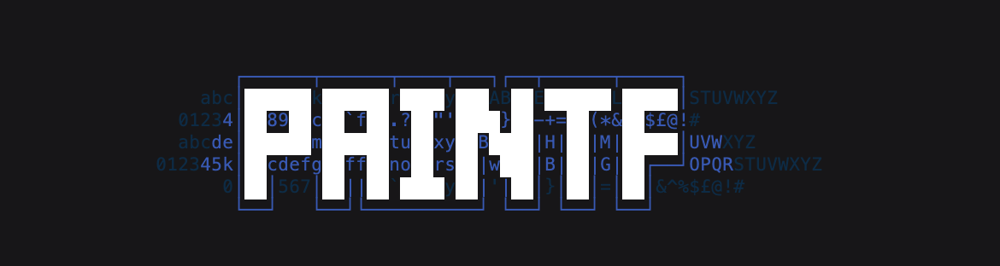

ASCII art editor for the web. Heavily inspired by [REXPaint](https://www.gridsagegames.com/rexpaint/) and probably the spiritual successor to [Siberia](https://github.com/danprince/siberia).

Hobby project, not a finished piece of software!

## Features
- Draw with glyphs, foreground and background colors
- Undo/redo changes
- Text and box drawing tools
- Box selection
- Copy/cut/paste
- Built-in color/glyph libraries
- Saves your document (and history) across sessions
- Masked painting  (lock glyph/foreground/color from changing as you paint)
- Import from `.xp` or `.txt` files (drag and drop)
- Export to `.svg`, `.png`, `.txt` or `.json`
- (Mostly) keyboard friendly
- (Mostly) VIM friendly

## Shortcuts

- <kbd>cmd+z</kbd> or <kbd>u</kbd> Undo
- <kbd>cmd+shift+z</kbd> or <kbd>r</kbd> Redo
- <kbd>cmd+c</kbd> or <kbd>y</kbd> Copy
- <kbd>cmd+x</kbd> or <kbd>x</kbd> Cut
- <kbd>cmd+v</kbd> or <kbd>p</kbd> Paste
- <kbd>cmd+a</kbd> Select all
- <kbd>shift+d</kbd> Show/hide debug info
- <kbd>shift+c</kbd> Swap foreground/background colors
- <kbd>backspace</kbd> or <kbd>delete</kbd> Delete the current selection
- <kbd>←</kbd> or <kbd>h</kbd> Move cursor left
- <kbd>↓</kbd> or <kbd>j</kbd> Move cursor down
- <kbd>→</kbd> or <kbd>h</kbd> Move cursor right
- <kbd>↑</kbd> or <kbd>j</kbd> Move cursor up

### Tools

- <kbd>p</kbd> Use the pen tool (currently conflicts with "paste")
- <kbd>e</kbd> Use the eraser tool
- <kbd>m</kbd> Use the select tool
- <kbd>t</kbd> Use the text tool
- <kbd>r</kbd> Use the rectangular drawing tool

### Pen

- <kbd>alt+lmb</kbd> Sample the glyph under the cursor

### Pickers

- <kbd>1</kbd> Open the glyph picker
- <kbd>2</kbd> Open the foreground color picker
- <kbd>3</kbd> Open the background color picker
- <kbd>4</kbd> Open the canvas color picker

### Masks

- <kbd>a</kbd> Turn on all masks
- <kbd>shift+f</kbd> Turn on foreground color mask only
- <kbd>shift+b</kbd> Turn on background color mask only
- <kbd>shift+g</kbd> Turn on glyph mask only
- <kbd>f</kbd> Toggle foreground color mask
- <kbd>b</kbd> Toggle background color mask
- <kbd>g</kbd> Toggle glyph mask

### Export

- <kbd>cmd+e</kbd> Export JSON
- <kbd>cmd+i</kbd> Export TXT
- <kbd>cmd+p</kbd> Export PNG
- <kbd>cmd+s</kbd> Export SVG

### Selection

- <kbd>Esc</kbd> Clear current selection
- <kbd>Enter</kbd> Fill current selection
